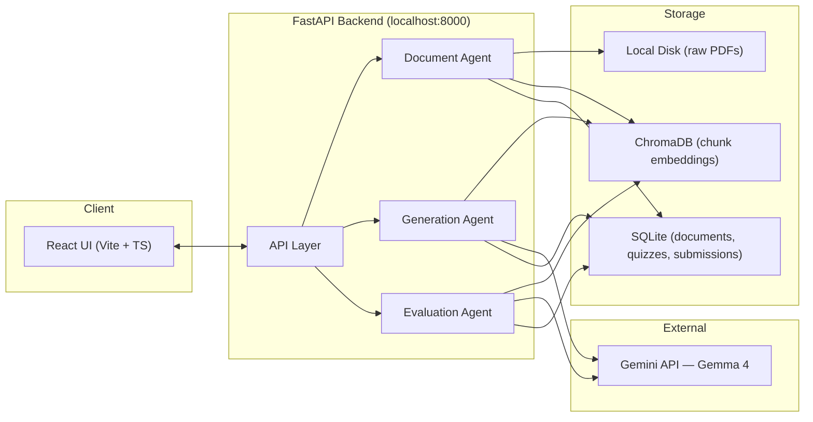
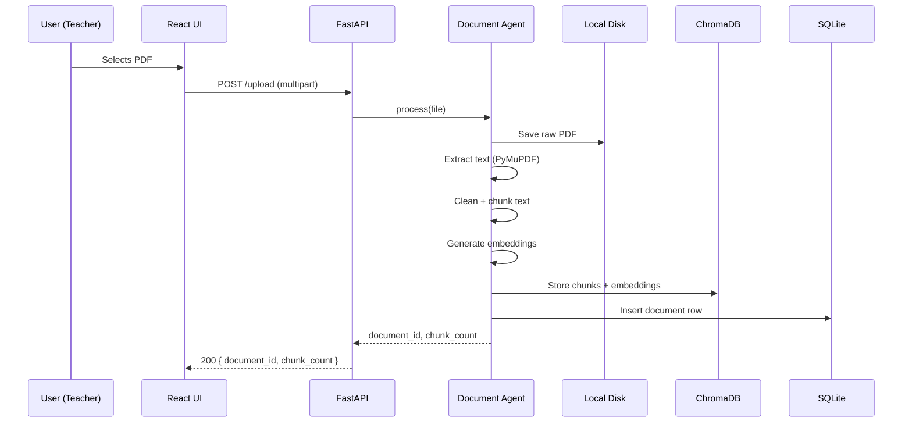
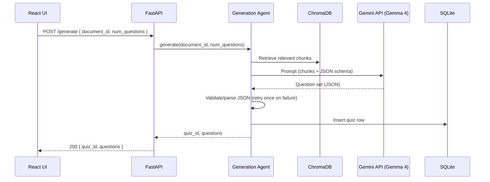
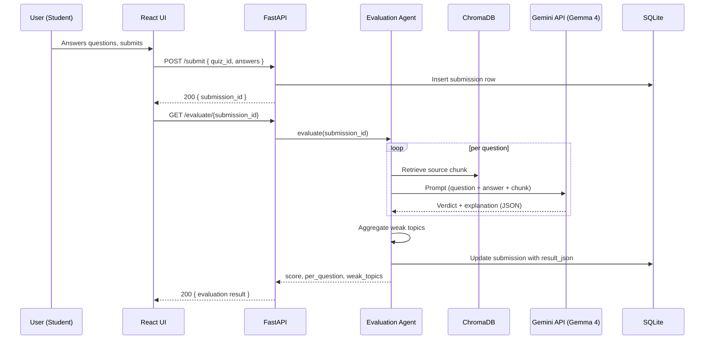
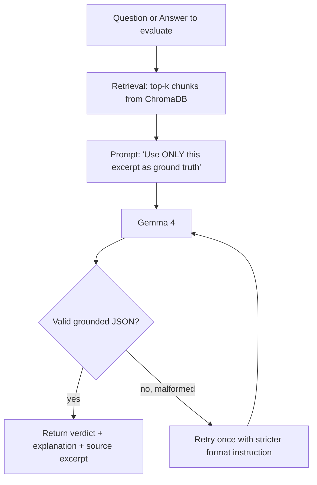
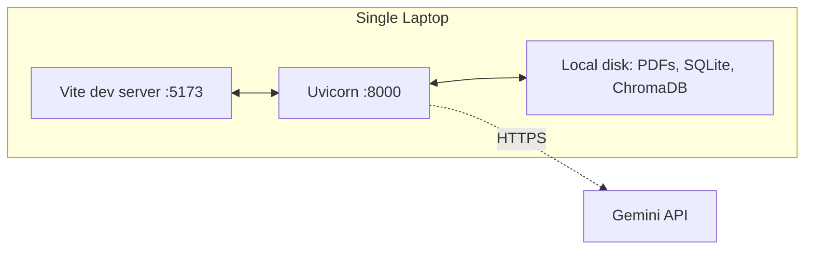
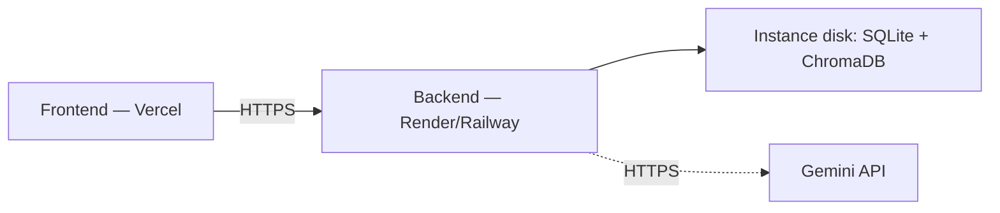

# Architecture — EduMentor AI

Companion to PRD v1 and TRD v1. Those cover scope and implementation details — this covers how the pieces fit together and how data moves through the system.

---

## 1. System Overview

## 2. Component Responsibilities

| Component | Owns | Does not do |
|---|---|---|
| **React UI** | Upload screen, quiz-attempt screen, results screen, client-side validation | Any grounding/retrieval logic, any LLM calls — it only talks to the FastAPI layer |
| **API Layer** | Route handling, request validation, orchestrating agent calls, error responses | Business logic — delegates to agents |
| **Document Agent** | PDF text extraction, cleaning, chunking, embedding, writing to ChromaDB + SQLite | Question generation or evaluation |
| **Generation Agent** | Retrieving relevant chunks, prompting Gemma 4, parsing/validating the returned question JSON | Storing raw files, evaluating answers |
| **Evaluation Agent** | Retrieving relevant chunks per question, prompting Gemma 4 for verdict + explanation, aggregating weak topics | Question generation |
| **ChromaDB** | Vector similarity search over syllabus chunks | Storing quiz/submission state (that's SQLite's job) |
| **SQLite** | Structured state: documents, quizzes, submissions, results | Vector search |

The Document/Generation/Evaluation split matters for the 24h build specifically because it lets each agent be developed and tested in isolation against a fixed ChromaDB collection — you don't need the full pipeline working to test the Evaluation Agent, just a populated collection and a sample answer.

## 3. Data Flow — Upload

## 4. Data Flow — Generate Quiz

## 5. Data Flow — Submit & Evaluate

## 6. Grounding Boundary (the core differentiator)

Every response the UI shows must be traceable to a specific retrieved chunk — this is what separates the system from a generic PDF chatbot and is worth surfacing visibly in the results UI (show the source excerpt next to the explanation), not just enforcing it server-side.

## 7. Deployment Topology

**24h build (primary target):**

**Stretch goal, if time remains:**

Note the stretch deployment keeps SQLite/ChromaDB as instance-local files — fine for a single demo session, not durable across redeploys. Don't invest in a managed DB for this hackathon; it's not worth the setup time against the payoff.

## 8. Failure Domains

| If this fails... | Blast radius | Contained by |
|---|---|---|
| Gemini API down/slow | Generation + Evaluation both blocked | Retry-once + clear UI error (TRD §7); pre-cache a known-good response for demo fallback |
| ChromaDB write fails on upload | Document unusable for generation | Fail the `/upload` call loudly rather than silently continuing |
| Malformed LLM JSON | Single question/evaluation, not the whole quiz | Per-question try/except, don't let one bad response 500 the whole endpoint |
| Frontend crash | UI only | Backend state is unaffected — refreshing the page and re-fetching by `quiz_id`/`submission_id` should recover |

This last point is why quiz/submission IDs are returned to the client rather than kept only in frontend state — it gives you a cheap recovery path if the UI hiccups mid-demo.
